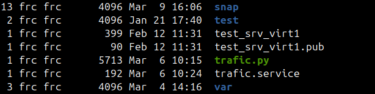

# Mise en place d'un routeur avec linux debian

Ce document décrit l'installation d'un routeur IPv4 avec Debian.

Le routeur fornis les fonctionnalités suivantes:
- DHCP
- DNS
- Firewall
- NAT


```bash
# exemple
ls -l
```





## Mise en place

### Etape 1


